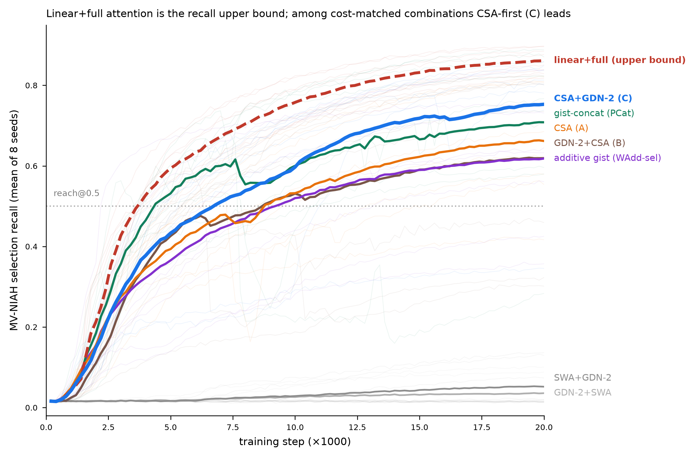
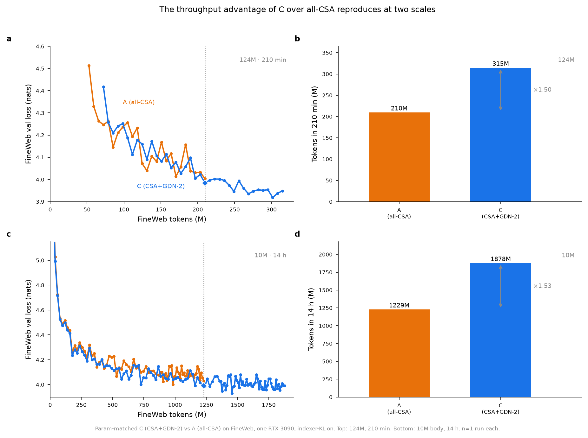

# Combining Linear Attention with Compressed Sparse Attention

Reproduction code for the paper **"Combining Linear Attention with Compressed Sparse
Attention: How Best to Mix Gated DeltaNet-2 into a CSA Stack"** (Andrei Iamaev).

We interleave / condition an NVIDIA **Gated DeltaNet-2 (GDN-2)** linear-attention layer
with **DeepSeek-V4's Compressed Sparse Attention (CSA)** and ask which combination is
best. The headline: **interleaving** a GDN-2 layer with a CSA layer (candidate **C**)
is the better-value combination — it leads pure-CSA on a controlled selection task and
matches its language-modeling quality while training ≈1.5× faster and serving prefill
≈1.4× faster.

---

## Main result

On the controlled **MV-NIAH** selection task (1M-param scale, mean of 8 seeds, KL-trained
indexer):

| Model | Architecture | Recall (mean±std) | reach@0.5 | grok step |
|-------|--------------|:-----------------:|:---------:|:---------:|
| **C** | CSA + GDN-2 (interleave) | **0.753 ± 0.158** | 7/8 | 5000 |
| PCat | CSA + CSA + GDN-2 gist (concat) | 0.708 ± 0.196 | 7/8 | 4600 |
| A (baseline) | CSA + CSA (all-CSA, DeepSeek-V4) | 0.662 ± 0.137 | 7/8 | 8400 |
| B | GDN-2 + CSA (opposite order) | 0.619 ± 0.207 | 5/8 | 5400 |
| WAdd-sel | CSA + CSA + GDN-2 gist (additive) | 0.618 ± 0.154 | 6/8 | 7700 |
| GDN-2 + SWA | linear + sliding-window (no CSA) | 0.036 ± 0.034 | 0/8 | — |
| SWA + GDN-2 | sliding-window + linear (no CSA) | 0.052 ± 0.050 | 0/8 | — |
| *LinFull* | *GDN-2 + full attention (quadratic)* | *0.861 ± 0.029* | *8/8* | *3800* |

**C** has the highest recall among the sub-quadratic, cost-matched combinations and groks
fastest. LinFull (full attention, quadratic) is the recall **upper bound**, shown italic
because it is not cost-matched. The two linear+sliding-window controls floor at chance:
with only an 8-token window, retrieval must pass through GDN-2's finite-rank recurrent
state, whose capacity the task (Q=8 needles under N=48 distractors) exceeds.

At FineWeb language-modeling scale, **C matches pure-CSA quality while training ≈1.5×
faster** (10M and 124M) and **serving prefill ≈1.4× faster on average, up to 1.7× at
4096 ctx**. Ablating C's GDN-2 layers costs +1.36 nats — they are load-bearing.





See `figures/fig3_gdn_ablation.png` (GDN-2 layer ablation) and
`figures/fig4_infer_speed.png` (prefill latency vs context).

---

## Setup

### 1. Environment
```bash
python3.12 -m venv venv && source venv/bin/activate
pip install -r requirements.txt
```
Requires a **CUDA GPU** (built and tested on an RTX 3090, CUDA 12.8). GDN-2's Triton
chunk kernel does not run on CPU.

### 2. Vendored GDN-2 kernel (not redistributed)
The GDN-2 token mixer + Triton kernel are from NVIDIA's
[GatedDeltaNet-2](https://github.com/NVlabs/GatedDeltaNet-2), released under the
**NVIDIA Source Code License-NC** (non-commercial). We do **not** redistribute it; clone
it yourself into the repo root so `src/gdn_import.py` can find it:
```bash
git clone https://github.com/NVlabs/GatedDeltaNet-2.git
# gdn_import.py expects ../GatedDeltaNet-2 relative to src/, i.e. repo-root/GatedDeltaNet-2
```
`src/gdn_import.py` imports only `lit_gpt.gdn2.GatedDeltaNet2` and its chunk kernel —
no flash-attn / lightning dependency.

### 3. Data (only for the language-modeling experiments, #2–#4)
The 1M-scale selection task (#1) is fully synthetic — no download needed. For FineWeb:
```bash
python src/data_fineweb.py --target_tokens 200000000 --out_dir data/fineweb   # ~200M, a few min
python src/data_fineweb.py --target_tokens 10000000000 --out_dir data/fineweb # full ~10B run
```

---

## Reproducing each experiment

All commands run from the repo root with `venv` activated.

### Experiment 1 — MV-NIAH selection (the main result, 1M scale, synthetic)
8-seed regime-S run under the KL indexer recipe. This is the exact command that produced
the table above (swap `--cands` for each candidate; `A B C PCat WAdd-sel SWA-A SWA-B`):
```bash
python src/csa_night_v2.py --regime S --cands A B C PCat WAdd-sel SWA-A SWA-B \
  --force_sweet 16 --rank_steps 20000 --warmup_steps 2000 --seeds 8 \
  --contention 1.0 --kl 1 --kl_weight 1.0 --sw 8
```
The **LinFull upper-bound** control decouples the model window from the task via
`--model_sw` (model gets a full 256-token window; the task still places needles beyond
the last `--sw 8`):
```bash
python src/csa_night_v2.py --regime S --cands LinFull \
  --force_sweet 16 --rank_steps 20000 --warmup_steps 2000 --seeds 8 \
  --contention 1.0 --kl 1 --kl_weight 1.0 --sw 8 --model_sw 256
```
Task difficulty was calibrated once by sweeping the CSA baseline's indexer top-k and
picking the partial operating point (top-k=16); see `src/csa_night_v2.py`.
Add `--aim 1 --aim_repo <dir-or-aim://host:port> --aim_exp <name>` to log to Aim.

Quick single-seed smoke test:
```bash
python src/csa_kl_validate.py   # ~1 min, one candidate/seed, sanity check
```

### Experiment 2 — FineWeb language modeling at 10M and 124M (throughput + quality)
Train the two candidates (A = all-CSA / DeepSeek, C = CSA+GDN-2). 10M body config:
```bash
python src/lm_train.py --cand DeepSeek --depth 6 --hidden 384 --heads 6 --ffn 565 \
  --ctx 2048 --batch 4 --grad_accum 12 --kl 1 --max_minutes 240 \
  --ckpt_dir ckpts_10m --ckpt ckpts_10m/DeepSeek_final.pt
python src/lm_train.py --cand C        --depth 6 --hidden 384 --heads 6 --ffn 862 \
  --ctx 2048 --batch 4 --grad_accum 12 --kl 1 --max_minutes 240 \
  --ckpt_dir ckpts_10m --ckpt ckpts_10m/C_final.pt
```
124M config: `--depth 12 --hidden 768 --heads 12 --ffn 2293` (DeepSeek) / `--ffn 2048` (C).
Resume with `--resume <ckpt>.pt --resume_tokens <N>` to extend a run.

### Experiment 3 — GDN-2 layer ablation (are the GDN-2 layers load-bearing?)
Zero each GDN-2 sublayer in a trained 10M C checkpoint and measure the FineWeb CE cost:
```bash
python csa_gdn_ablate.py --ckpt ckpts_10m/C_final.pt --ffn 862 --iters 50 \
  --out results/gdn_ablation_C.json
```
Expected: removing all GDN-2 layers costs +1.36 nats; the earliest layer matters most.

### Experiment 4 — Prefill inference speed (A vs C)
Time full-sequence prefill latency across context lengths on the trained 10M models:
```bash
python csa_infer_bench.py \
  --ckpt_A ckpts_10m/DeepSeek_final.pt --ffn_A 565 \
  --ckpt_C ckpts_10m/C_final.pt       --ffn_C 862 \
  --ctxs 512,1024,2048,3072,4096 --reps 40 --warmup 10 --batch 1 \
  --out results/infer_bench_A_vs_C.json
```
This measures **prefill only** (the GDN-2 layer here is implemented cache-free);
incremental decoding depends on runtime kernel/KV-cache implementation and is out of
scope.

### Experiment 5 — Analytic prefill FLOPs (A vs C, all three scales)
Count prefill FLOPs for the parameter-matched A and C models at 1M / 10M / 124M across a
context sweep, to separate the structural cost difference from hardware efficiency:
```bash
python csa_flops.py --out results/csa_flops.json
```
Uses PyTorch's operator-level FLOP counter (captures the CSA compressor, Lightning
Indexer, sliding-window attention, MLP and LM head) plus an analytic term for the GDN-2
chunk recurrence (a fused kernel the counter does not see). The A/C FLOP ratio grows with
context (e.g. 10M: 1.05× at 512 → 1.31× at 4096) and sits **below** the measured
wall-clock speedup — the surplus is GPU-utilization efficiency, not arithmetic.

---

## Repository layout

```
reproduce/
├── README.md
├── requirements.txt
├── src/                       # model + training/eval modules (self-contained closure)
│   ├── csa_candidates.py       # candidate definitions (A,B,C,PCat,WAdd-sel,SWA,LinFull) + GDN-2 wiring
│   ├── csa_night_v2.py         # Exp-1 entry: MV-NIAH selection, KL recipe, multi-seed
│   ├── csa_kl_validate.py      # Exp-1 single-seed smoke
│   ├── csa_model.py            # CSA layer + param counting
│   ├── csa_gist_layer.py       # gist-conditioning variants (PCat, WAdd-sel)
│   ├── csa_tasks_v2.py         # synthetic MV-NIAH task / vocab
│   ├── lm_train.py             # Exp-2 entry: FineWeb LM training (+ resume, NIAH eval)
│   ├── lm_config.py, lm_bench.py
│   ├── data_fineweb.py         # FineWeb -> token shards + loader
│   ├── data_instruct.py, eval_niah.py, eval_position.py
│   ├── muon.py                 # optimizer (Muon + AdamW groups, GDN-2 LR)
│   ├── gdn_import.py           # path shim to vendored NVIDIA GDN-2 kernel
│   └── runlog.py
├── csa_gdn_ablate.py          # Exp-3 entry: GDN-2 layer ablation
├── csa_infer_bench.py         # Exp-4 entry: prefill latency A vs C
├── csa_flops.py              # Exp-5 entry: analytic prefill FLOPs A vs C
├── figures/                   # the 4 paper figures (fig1..fig4)
└── results/                   # the result JSONs behind every number above
```

`results/` contains the exact numbers reported: `kl_regimeS_results.json` (Exp-1 table),
`linfull_state.json` (LinFull bound), `scale10m_A_vs_C.json` + `124M_lm_*.json` (Exp-2),
`gdn_ablation_C.json` (Exp-3), `infer_bench_A_vs_C.json` (Exp-4).

## Notes on faithful reproduction
- **Seeds / variance.** Recall numbers are the mean of 8 seeds; single seeds vary by
  ±0.1–0.2. The candidate *ordering* (C > A, SWA floors) is stable; a given seed's
  absolute recall is not.
- **GPU.** All experiments were run on a single RTX 3090 (24 GB). Larger batch than the
  configs above will OOM at 124M.
- **Training recipe.** The indexer is trained by KL-to-dense-attention (DeepSeek-V3.2/V4
  recipe): dense warm-up (`--warmup_steps`) then sparse top-k. Every reported number is
  under this recipe.

## License
Code in this repository is released under the **Apache License 2.0** (see `LICENSE`).
The vendored **GatedDeltaNet-2** kernel is NOT included here and is NOT covered by this
license — it is NVIDIA's, under the **NVIDIA Source Code License-NC** (non-commercial);
clone it yourself from https://github.com/NVlabs/GatedDeltaNet-2 (see Setup).

## Citation
```bibtex
@misc{iamaev2026csagdn2,
  title  = {Combining Linear Attention with Compressed Sparse Attention:
            How Best to Mix Gated DeltaNet-2 into a CSA Stack},
  author = {Andrei Iamaev},
  year   = {2026},
  eprint = {arXiv:XXXX.XXXXX},
  note   = {Code: https://github.com/rewin123/csa-gdn2}
}
```
